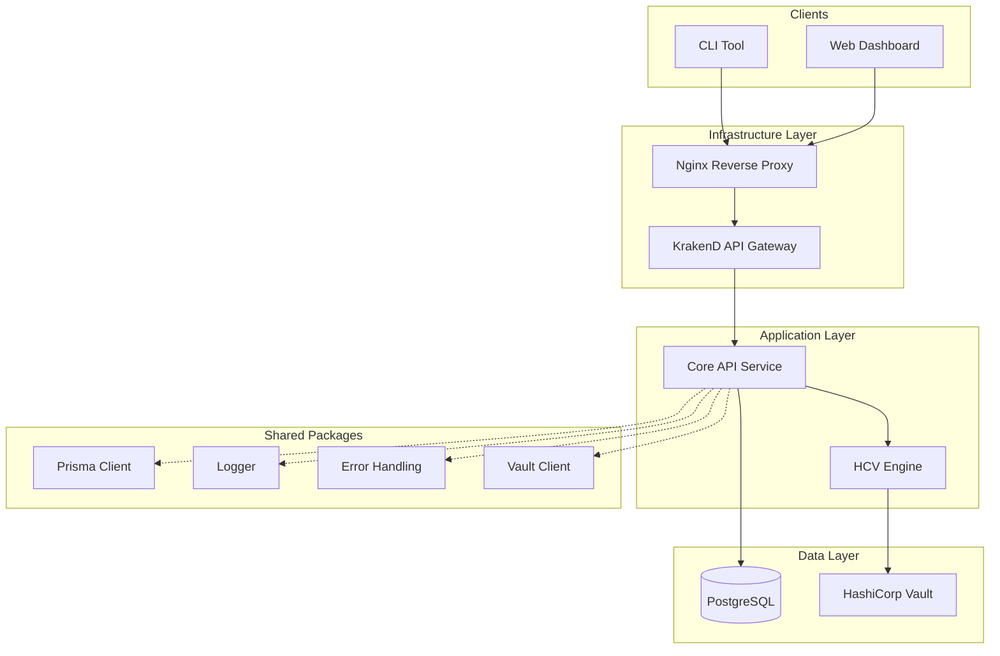

# Hermit KMS - System Overview

Hermit KMS is a secure, enterprise-grade Key Management System (KMS) designed to manage encryption keys, store secrets, and handle cryptographic operations with multi-tier security controls.

## 🏛️ System Architecture

Hermit KMS follows a modern, service-oriented architecture designed for security, scalability, and ease of deployment.

### Core Components

1.  **Web Dashboard (`apps/web`)**: A Next.js-based web interface for managing vaults, secrets, users, and organizations.
2.  **CLI Tool (`apps/cli`)**: A TypeScript-based command-line interface for automated workflows and terminal-based access.
3.  **API Gateway (`apps/krakend`)**: A KrakenD instance that serves as the entry point for all API requests, providing routing and request aggregation.
4.  **Core API (`apps/api`)**: An Express.js application that handles business logic, identity and access management (IAM), and secret metadata.
5.  **HCV Engine (`apps/hcv_engine`)**: A specialized service/integration layer for communicating with HashiCorp Vault.
6.  **HashiCorp Vault**: The primary cryptographic backend, utilizing the Transit Secret Engine for encryption-as-a-service.
7.  **PostgreSQL**: Stores persistent metadata, including organization structures, user profiles, vault permissions, and encrypted secret references.

---

## 🔒 Security Architecture

Hermit KMS implements a defense-in-depth strategy with multiple layers of protection.

### 1. Authentication & IAM
- **JWT-based Auth**: Secure token-based authentication with access and refresh tokens.
- **MFA Support**: Multi-Factor Authentication (TOTP) for enhanced user security.
- **Organizations & Groups**: Hierarchical organization structure with granular group-based permissions.

### 2. Three-Tier Secret Protection
Secrets can be protected by up to three independent layers:
1.  **Authentication**: Users must be authenticated and have explicit permission to the vault containing the secret.
2.  **Vault Password**: An optional password required to access any secret within a specific vault.
3.  **Secret Password**: An optional, unique password required to reveal the specific secret.

### 3. Encryption at Rest
- All sensitive data is encrypted using **HashiCorp Vault's Transit Engine**.
- The API never stores plaintext secrets in the primary database.
- Encryption keys are managed by Vault and never exposed to the application layer in their raw form.

---

## 🔄 Data Flow

### Secret Creation Flow
1. Client sends a plaintext secret to the API (via Gateway).
2. API validates permissions and authentication.
3. API sends the plaintext to the **HCV Engine**.
4. HCV Engine uses **HashiCorp Vault** to encrypt the data.
5. API receives the ciphertext and stores it in **PostgreSQL** along with metadata.

### Secret Retrieval Flow
1. Client requests a secret reveal.
2. API verifies the user's JWT and checks RBAC permissions.
3. If required, the client provides Vault and/or Secret passwords.
4. API verifies passwords and sends the ciphertext to the **HCV Engine**.
5. HCV Engine uses **HashiCorp Vault** to decrypt the data.
6. API returns the plaintext secret to the client.

---

## 🚀 Deployment & Infrastructure

### Environments
- **Development**: Managed via Docker Compose (`docker-compose.yml`) for local development.
- **Production**: Deployed using Docker images via GitHub Packages (GHCR).

### Infrastructure Components
- **Nginx**: Handles TLS termination and serves as a reverse proxy.
- **Certbot**: Manages automated SSL certificate renewal via Let's Encrypt.
- **Docker Compose**: Orchestrates services on the host machine.

### Deployment Workflow
1. Code is pushed to GitHub.
2. CI/CD (GitHub Actions) builds and pushes Docker images to GHCR.
3. `deploy.sh` script on the target VPS pulls images and restarts services.
4. Database migrations are handled automatically via `prisma migrate deploy`.

---

## 🛠️ Operational Procedures

### Monitoring & Health
- **Health Checks**: Every service exposes a `/health` endpoint.
- **Status Dashboard**: The Core API provides a `/status` endpoint that checks connectivity to both PostgreSQL and Vault.
- **Audit Logging**: All sensitive operations are recorded in the audit log for compliance and security monitoring.

### Maintenance Tasks
- **Database Migrations**: Performed using Prisma during deployment.
- **Vault Unsealing**: Required when the Vault service restarts (can be automated via Cloud KMS).
- **Log Rotation**: Handled by a background worker in the API service.

### Backup & Recovery
- **Database Backups**: Periodic PostgreSQL dumps.
- **Vault Backups**: Regular snapshots of the Vault storage backend.
- **Disaster Recovery**: Infrastructure can be reconstructed using the `deploy.sh` script and configuration backups.
