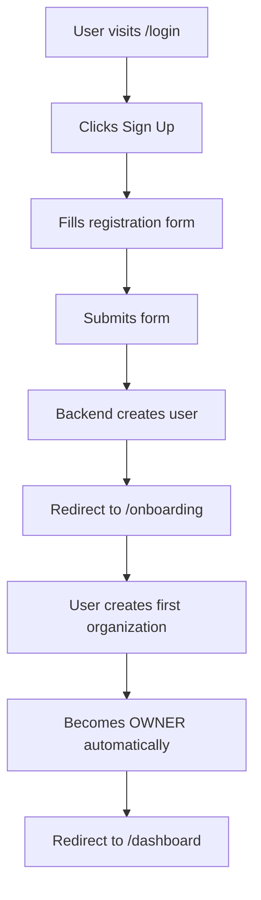
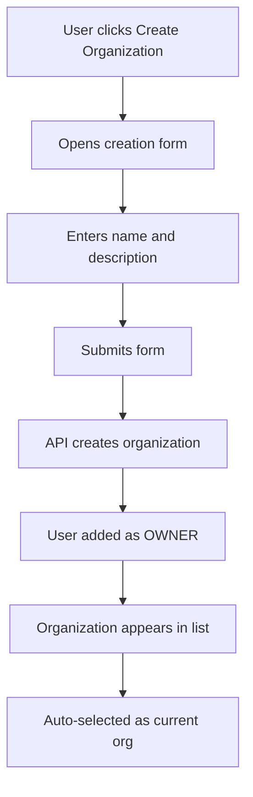
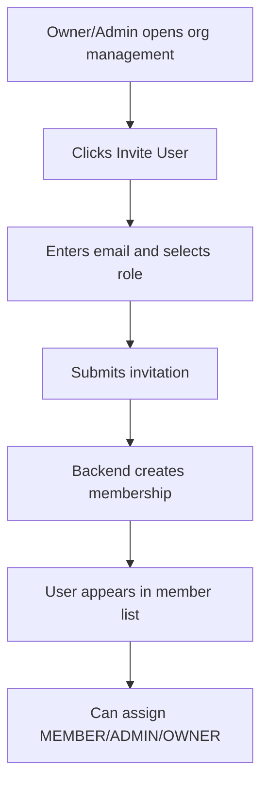
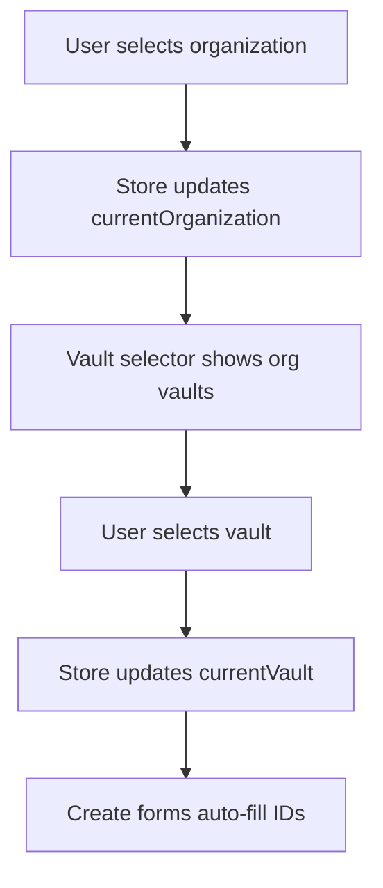

# Organization System Documentation

## Overview
The Hermit KMS organization system provides a comprehensive multi-tenant architecture with role-based access control (RBAC). This system allows users to create organizations, invite team members, manage roles, and organize their keys and secrets within vaults.

## Architecture

### Hierarchy
```
User
  └── Organization (Member/Admin/Owner)
      └── Vault
          ├── Keys
          └── Secrets
```

### Components

#### 1. **Onboarding Flow** (`/onboarding`)
- **Purpose**: First-time user experience after registration
- **Location**: `apps/web/src/app/onboarding/page.tsx`
- **Features**:
  - Guided organization creation
  - Clear value proposition
  - Automatic redirect to dashboard after creation
- **Workflow**:
  1. User completes registration
  2. Redirected to `/onboarding`
  3. Creates first organization (becomes OWNER)
  4. Redirected to `/dashboard`

#### 2. **Organization Management** (`/dashboard/organizations`)
- **Purpose**: Manage all organizations and team members
- **Location**: `apps/web/src/app/dashboard/organizations/page.tsx`
- **Features**:
  - View all organizations user belongs to
  - Create new organizations
  - Edit organization details (name, description)
  - Delete organizations (OWNER only)
  - Invite users by email
  - Remove team members
  - Update member roles
  - Visual role badges
  - Member and vault counts

#### 3. **Organization Selector** (Sidebar)
- **Purpose**: Quick organization switching
- **Location**: `apps/web/src/components/organization-selector.tsx`
- **Features**:
  - Dropdown with all user organizations
  - Auto-select first organization
  - Shows user role for each org
  - Create new organization button
  - Persisted selection across sessions

#### 4. **Vault Selector** (Sidebar)
- **Purpose**: Quick vault switching within organization
- **Location**: `apps/web/src/components/vault-selector.tsx`
- **Features**:
  - Filtered by current organization
  - Auto-select first vault
  - Shows key count per vault
  - Create new vault button
  - Disabled until organization selected

## Role-Based Access Control (RBAC)

### Roles

#### OWNER
- **Capabilities**: Full control over organization
- **Permissions**:
  - All ADMIN permissions
  - Delete organization
  - Change any member's role
  - Transfer ownership
- **Limitations**: Each organization must have at least one owner

#### ADMIN
- **Capabilities**: Manage resources and team
- **Permissions**:
  - Create/edit/delete vaults
  - Create/edit/delete keys and secrets
  - Invite new members
  - Remove members (except owners)
  - Update organization settings
- **Limitations**: Cannot delete organization or change owner roles

#### MEMBER
- **Capabilities**: Use resources
- **Permissions**:
  - Create vaults
  - Create/edit keys and secrets
  - Rotate keys
  - Reveal secrets
  - View all organization resources
- **Limitations**: Cannot manage team members or delete organization

### Permission Matrix

| Action | Owner | Admin | Member |
|--------|-------|-------|--------|
| Create Organization | ✅ | ✅ | ✅ |
| Edit Organization | ✅ | ✅ | ❌ |
| Delete Organization | ✅ | ❌ | ❌ |
| Invite Users | ✅ | ✅ | ❌ |
| Remove Members | ✅ | ✅ | ❌ |
| Change Roles | ✅ | ❌ | ❌ |
| Create Vault | ✅ | ✅ | ✅ |
| Edit Vault | ✅ | ✅ | ✅ |
| Delete Vault | ✅ | ✅ | ❌ |
| Create Key | ✅ | ✅ | ✅ |
| Edit Key | ✅ | ✅ | ✅ |
| Delete Key | ✅ | ✅ | ❌ |
| Rotate Key | ✅ | ✅ | ✅ |
| Create Secret | ✅ | ✅ | ✅ |
| Edit Secret | ✅ | ✅ | ✅ |
| Delete Secret | ✅ | ✅ | ❌ |
| Reveal Secret | ✅ | ✅ | ✅ |

### RBAC Hook Usage

```typescript
import { useRBAC } from "@/hooks/use-rbac";

function MyComponent() {
  const permissions = useRBAC();

  return (
    <>
      {permissions.canCreateVault && (
        <Button onClick={handleCreateVault}>Create Vault</Button>
      )}
      
      {permissions.canInviteMembers && (
        <Button onClick={handleInvite}>Invite User</Button>
      )}
    </>
  );
}
```

## State Management

### Organization Store
**Location**: `apps/web/src/store/organization.store.ts`

**Purpose**: Global state for selected organization and vault context

**State**:
```typescript
{
  currentOrganization: Organization | null;
  currentVault: { id: string; name: string; organizationId: string } | null;
}
```

**Methods**:
- `setCurrentOrganization(org)`: Set active organization
- `setCurrentVault(vault)`: Set active vault
- `clearContext()`: Clear vault selection (called when switching orgs)

**Persistence**: Stored in localStorage for session continuity

### Auth Store
**Location**: `apps/web/src/store/auth.store.ts`

**Relevant Fields**:
- `user`: Current authenticated user
- `isAuthenticated`: Boolean flag

## API Integration

### Organization Service
**Location**: `apps/web/src/services/organization.service.ts`

#### Methods:

##### `getAll()`
- **Returns**: `Organization[]`
- **Description**: Fetch all organizations user belongs to
- **Response**: `response.data.data.organizations`

##### `getById(id)`
- **Returns**: `Organization`
- **Description**: Fetch single organization with members
- **Response**: `response.data.data.organization`

##### `create(data)`
- **Params**: `{ name: string; description?: string }`
- **Returns**: `Organization`
- **Description**: Create new organization (user becomes OWNER)

##### `update(id, data)`
- **Params**: `{ name?: string; description?: string }`
- **Returns**: `Organization`
- **Description**: Update organization details

##### `delete(id)`
- **Returns**: `void`
- **Description**: Delete organization (OWNER only)

##### `inviteUser(organizationId, data)`
- **Params**: `{ email: string; role?: "OWNER" | "ADMIN" | "MEMBER" }`
- **Returns**: `OrganizationMember`
- **Description**: Invite user to organization

##### `removeMember(organizationId, userId)`
- **Returns**: `void`
- **Description**: Remove member from organization

##### `updateMemberRole(organizationId, userId, data)`
- **Params**: `{ role: "OWNER" | "ADMIN" | "MEMBER" }`
- **Returns**: `OrganizationMember`
- **Description**: Update member's role

### React Query Hooks
**Location**: `apps/web/src/hooks/use-organizations.ts`

#### Available Hooks:

##### `useOrganizations()`
```typescript
const { data: organizations, isLoading } = useOrganizations();
```

##### `useOrganization(id)`
```typescript
const { data: organization, isLoading } = useOrganization(orgId);
```

##### `useCreateOrganization()`
```typescript
const { mutate: createOrg, isPending } = useCreateOrganization();

createOrg(
  { name: "Acme Corp", description: "Main org" },
  {
    onSuccess: (data) => {
      // Organization created
    },
  }
);
```

##### `useUpdateOrganization()`
```typescript
const { mutate: updateOrg } = useUpdateOrganization();

updateOrg({
  id: orgId,
  data: { name: "New Name" }
});
```

##### `useDeleteOrganization()`
```typescript
const { mutate: deleteOrg } = useDeleteOrganization();

deleteOrg(orgId);
```

##### `useInviteUser()`
```typescript
const { mutate: inviteUser } = useInviteUser();

inviteUser({
  organizationId: orgId,
  data: { email: "user@example.com", role: "MEMBER" }
});
```

##### `useRemoveMember()`
```typescript
const { mutate: removeMember } = useRemoveMember();

removeMember({
  organizationId: orgId,
  userId: userId
});
```

##### `useUpdateMemberRole()`
```typescript
const { mutate: updateRole } = useUpdateMemberRole();

updateRole({
  organizationId: orgId,
  userId: userId,
  data: { role: "ADMIN" }
});
```

## User Flows

### 1. New User Registration


### 2. Creating an Organization


### 3. Inviting Team Members


### 4. Working with Context


## Best Practices

### 1. Always Check Organization Context
```typescript
const { currentOrganization } = useOrganizationStore();

if (!currentOrganization) {
  return <div>Please select an organization first</div>;
}
```

### 2. Use RBAC for UI Control
```typescript
const permissions = useRBAC();

// Hide delete button from non-owners
{permissions.canDeleteOrganization && (
  <Button onClick={handleDelete}>Delete</Button>
)}
```

### 3. Auto-fill Form Data
```typescript
const { currentOrganization, currentVault } = useOrganizationStore();

const handleCreateKey = (data) => {
  createKey({
    ...data,
    organizationId: currentOrganization.id,
    vaultId: currentVault.id,
  });
};
```

### 4. Handle Organization Changes
```typescript
// Clear vault when org changes
const handleOrgChange = (org) => {
  setCurrentOrganization(org);
  clearContext(); // Clears vault selection
};
```

## Security Considerations

1. **Backend Validation**: All permissions are enforced on the backend
2. **Frontend RBAC**: UI controls prevent unauthorized actions
3. **Token-based Auth**: All API calls include authentication token
4. **Role Hierarchy**: Owner > Admin > Member
5. **Audit Trail**: All organization changes are logged (backend)

## Future Enhancements

### Planned Features
- [ ] Organization invitations via email with expiry
- [ ] Pending invitation management
- [ ] Organization settings page
- [ ] Transfer ownership workflow
- [ ] Audit log viewer
- [ ] Team activity dashboard
- [ ] Multi-organization bulk operations
- [ ] Organization templates

### Potential Improvements
- [ ] SSO/SAML integration
- [ ] Custom role creation
- [ ] Granular permissions per vault
- [ ] Organization billing and quotas
- [ ] API key management per organization

## Troubleshooting

### Organization not appearing
- Check if user is authenticated
- Verify backend returned organization in API response
- Check browser console for errors

### Cannot invite users
- Verify user has OWNER or ADMIN role
- Check email format is valid
- Ensure invited user doesn't already exist in org

### Selectors not showing data
- Verify organization store has current organization set
- Check if API calls are successful (network tab)
- Ensure auto-select logic ran on mount

### Permission denied errors
- Verify user's role for the organization
- Check RBAC permissions match required action
- Confirm backend permission checks are aligned

## Support

For issues or questions:
1. Check this documentation
2. Review API controller: `apps/api/src/controllers/organization.controller.ts`
3. Check wrapper logic: `apps/api/src/wrappers/organization.wrapper.ts`
4. Verify database schema: `packages/prisma/schema.prisma`
